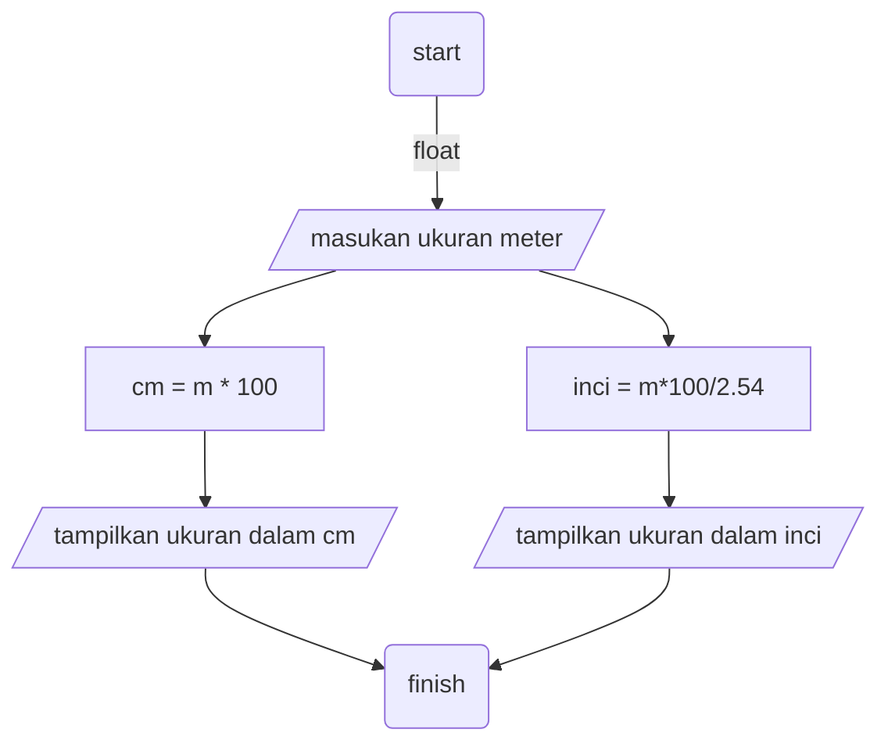

```mermaid
    graph TD;
    A(start)--float-->B[/masukan ukuran meter/]
    B-->C[cm = m * 100]
    B-->D[inci = m*100/2.54]
    C-->F[/tampilkan ukuran dalam cm/]
    D-->G[/tampilkan ukuran dalam inci/]
    F & G-->H(finish)
```