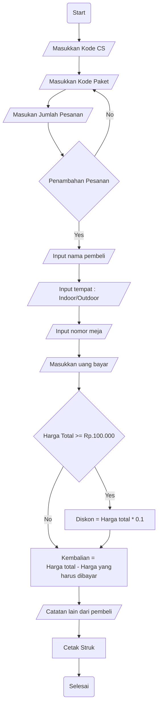

```mermaid
    flowchart TD;
    A(Start) --> B[/Masukkan Kode CS/]
    B--> C[/Masukkan Kode Paket/]
    C--> D[/Masukan Jumlah Pesanan/]
    D--> E{Penambahan Pesanan} 
    E-->|No| C
    E--> |Yes| H[/Input nama pembeli/]
    H--> I[/Input tempat :  Indoor/Outdoor/] 
    I--> J[/Input nomor meja/]
    J--> K[/Masukkan uang bayar/]
    K--> L{Harga Total >= Rp.100.000}
    L--> |Yes| M[Diskon = Harga total * 0.1]  
    L--> |No| N[Harga yang harus dibayar]
    M--> N[Kembalian = \n Harga total - Harga yang harus dibayar]
    N--> O[/Catatan lain dari pembeli/]
    O--> P[Cetak Struk]
    P--> Q(Selesai)
```