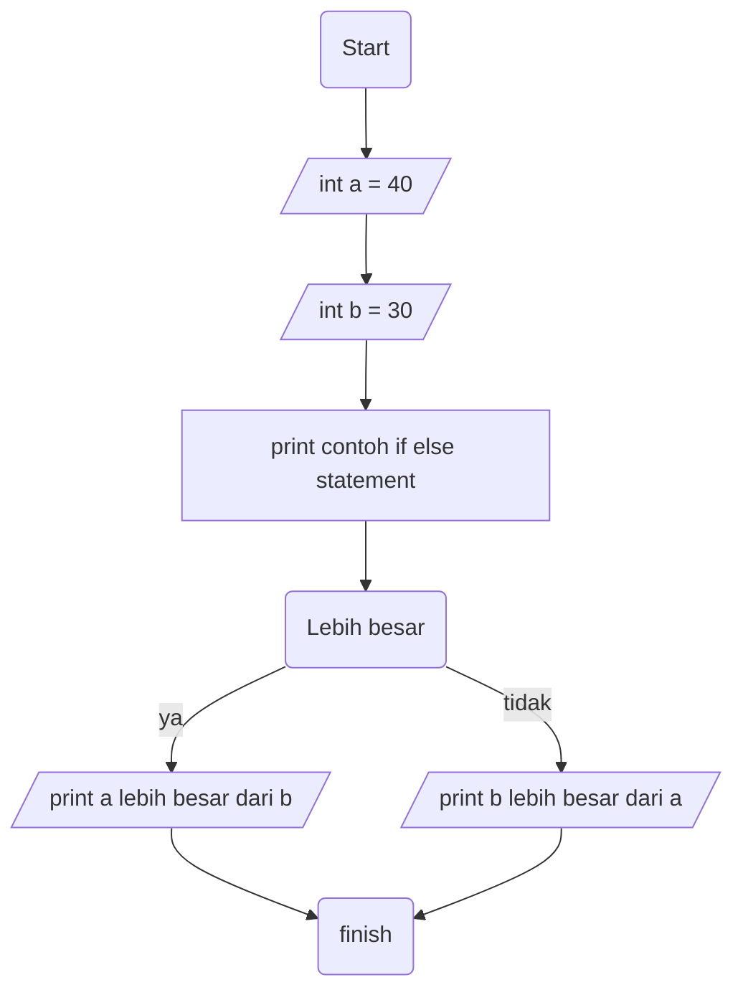

```mermaid
    flowchart TD;
    A(Start)-->B[/int a = 40/];
    B --> C[/int b = 30/];
    C --> D[print contoh if else statement];
    D --> E(Lebih besar);
    E --ya--> F[/print a lebih besar dari b/];
    E --tidak--> G[/print b lebih besar dari a/];
    F & G --> H(finish)
```