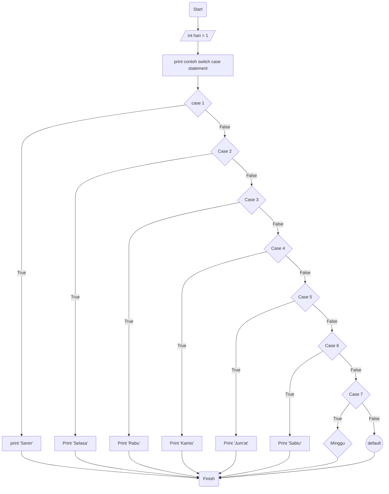

```mermaid
    flowchart TD;
    A(Start)-->B[/int hari = 1/];
    B --> C[print contoh switch case statement];
    C --> D{case 1};
    D --True--> E[print 'Senin'];
    D --False--> F{Case 2};
    F --True--> G[Print 'Selasa'];
    F --False--> H{Case 3};
    H --True--> I[Print 'Rabu'];
    H --False--> J{Case 4};
    J --True--> K[Print 'Kamis'];
    J --False--> L{Case 5};
    L --True-->  M[Print 'Jum'at'];
    L --False--> N{Case 6};
    N --True--> O[Print 'Sabtu'];
    N --False--> P{Case 7};
    P --True--> Q{Minggu};
    P --False--> R((default));
    E & G & I & K & M & O & Q & R --> S(Finish);
```